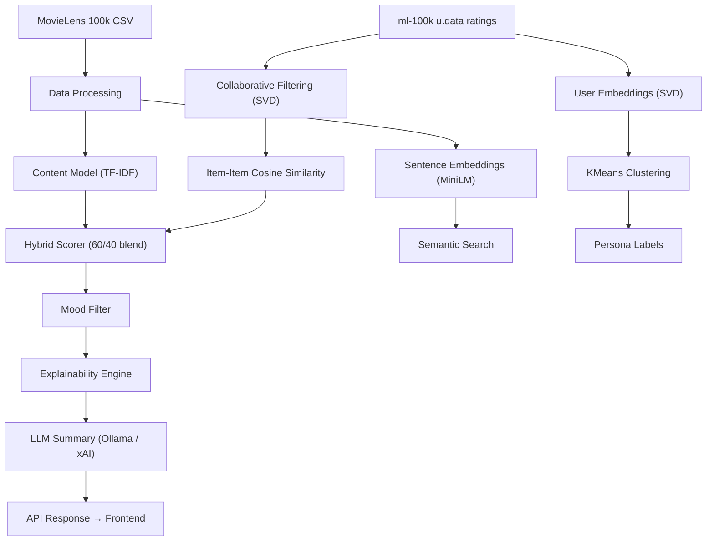
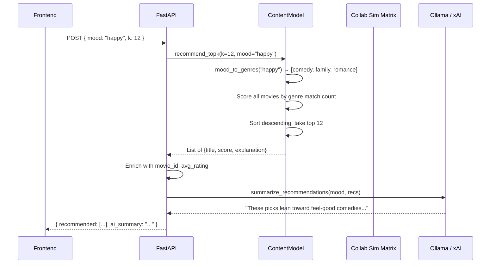

# How the ML Model Works in CineMind

This document explains every layer of the recommendation engine, from raw data to the final response the user sees.

---

## High-Level Architecture



The system is a **four-layer hybrid** recommendation engine:

| Layer | Technique | Purpose |
|-------|-----------|---------|
| **1. Content-Based** | TF-IDF + cosine similarity | Find movies with similar metadata (genres, cast, directors) |
| **2. Collaborative** | SVD on user-item ratings | Find movies liked by similar users |
| **3. Semantic** | Sentence-Transformer embeddings | Natural-language search over movie metadata |
| **4. Persona** | SVD + KMeans clustering on users | Assign users to viewing archetypes |

---

## Layer 1: Content-Based Filtering (TF-IDF)

**Source**: [pipeline.py](file:///d:/movielens_100k.csv/ml/pipeline.py)

This is the **primary recommendation engine** and the backbone of the system.

### How It Works

1. **Load & Preprocess** ([data_processing.py](file:///d:/movielens_100k.csv/ml/data_processing.py))
   - Reads `movielens_100k.csv` into a Pandas DataFrame
   - Drops rows where all of `directors`, `actors`, `genres` are NaN
   - Fills remaining NaN values with empty strings

2. **Build Combined Feature String** ([pipeline.py:31-33](file:///d:/movielens_100k.csv/ml/pipeline.py#L31-L33))
   ```
   combined = directors + " " + actors + " " + genres
   ```
   Each movie becomes a single text string like:
   ```
   "steven spielberg tom hanks drama war"
   ```

3. **TF-IDF Vectorization** ([pipeline.py:36-37](file:///d:/movielens_100k.csv/ml/pipeline.py#L36-L37))
   ```python
   TfidfVectorizer(analyzer='word', ngram_range=(1,3), min_df=1, stop_words='english')
   ```
   - Uses **unigrams, bigrams, and trigrams** (1–3 word n-grams)
   - Removes English stop words
   - Each movie becomes a sparse vector in TF-IDF space
   - The matrix shape is `(num_movies, vocab_size)`

4. **Cosine Similarity Matrix** ([pipeline.py:38](file:///d:/movielens_100k.csv/ml/pipeline.py#L38))
   ```python
   sim_matrix = linear_kernel(tfidf_matrix, tfidf_matrix)
   ```
   - `linear_kernel` computes dot products between all TF-IDF vectors
   - Since TF-IDF vectors are L2-normalized, this equals cosine similarity
   - Result: an `(N × N)` similarity matrix where `sim_matrix[i][j]` is the content similarity between movie `i` and movie `j`

### How Recommendations Are Generated

When a user provides a **seed title** (e.g., "Toy Story"):

1. Look up the movie's index in the DataFrame
2. Read row `sim_matrix[idx]` — the similarity scores to every other movie
3. Sort by score descending
4. Return top-k results (excluding the seed itself)

---

## Layer 2: Collaborative Filtering (SVD)

**Source**: [cf.py](file:///d:/movielens_100k.csv/ml/cf.py) · [train_cf.py](file:///d:/movielens_100k.csv/ml/train_cf.py)

This layer captures **"users who liked X also liked Y"** patterns that content analysis alone cannot detect.

### Training Pipeline

1. **Load Ratings** ([cf.py:15-30](file:///d:/movielens_100k.csv/ml/cf.py#L15-L30))
   - Reads `u.data` (100,000 ratings from 943 users on 1,682 movies)
   - Reads `u.item` (movie metadata)

2. **Matrix Factorization** ([cf.py:33-57](file:///d:/movielens_100k.csv/ml/cf.py#L33-L57))
   - **Primary**: Uses the `surprise` library's **SVD** algorithm with 50 latent factors
     - Decomposes the user-item rating matrix into user factors `P` and item factors `Q`
     - Each movie gets a 50-dimensional latent vector (`algo.qi[inner_id]`)
   - **Fallback**: If `surprise` is not installed, uses scikit-learn's `TruncatedSVD` on the transposed pivot table

3. **Item-Item Similarity** ([cf.py:56](file:///d:/movielens_100k.csv/ml/cf.py#L56))
   ```python
   sim = cosine_similarity(factors)   # shape: (num_items, num_items)
   ```
   The latent factor vectors are compared via cosine similarity to produce an item-item collaborative similarity matrix.

4. **Persistence** ([train_cf.py](file:///d:/movielens_100k.csv/ml/train_cf.py))
   - Saves `cf_sim.npy` (~22 MB, the full similarity matrix)
   - Saves `id_to_index.json` (maps `movie_id → matrix index`)

### Pre-trained Artifacts

| File | Size | Purpose |
|------|------|---------|
| [cf_sim.npy](file:///d:/movielens_100k.csv/ml/models/cf_sim.npy) | 22.6 MB | Item-item collaborative similarity matrix |
| [id_to_index.json](file:///d:/movielens_100k.csv/ml/models/id_to_index.json) | 21 KB | Movie ID → matrix position mapping |

---

## The Hybrid Score — How Content + Collaborative Merge

**Source**: [pipeline.py:90-98](file:///d:/movielens_100k.csv/ml/pipeline.py#L90-L98)

When the collaborative similarity matrix is available, the system blends both signals:

```python
content_weight = 0.6
combined_scores = content_weight * content_scores + (1 - content_weight) * collab_scores
```

> **Formula**: `final_score = 0.6 × TF-IDF_similarity + 0.4 × SVD_collaborative_similarity`

This means:
- **60%** of the score comes from shared metadata (genres, cast, directors)
- **40%** of the score comes from collaborative patterns (users who rated both movies similarly)

### Alignment Step

At startup, the collaborative similarity matrix (indexed by `movie_id`) is **re-aligned** to match the content DataFrame's row indices ([pipeline.py:58-69](file:///d:/movielens_100k.csv/ml/pipeline.py#L58-L69)). This creates a new `(N × N)` matrix where row/column positions match the content model exactly, allowing direct element-wise addition.

---

## Layer 3: Semantic Search (Sentence Embeddings)

**Source**: [semantic_search.py](file:///d:/movielens_100k.csv/ml/semantic_search.py) · [embeddings.py](file:///d:/movielens_100k.csv/ml/embeddings.py)

This layer powers **free-text search** (e.g., "funny movies about space").

### How It Works

1. **Build Corpus** ([semantic_search.py:24-34](file:///d:/movielens_100k.csv/ml/semantic_search.py#L24-L34))
   - For each movie: `text = title + genres + directors + actors`

2. **Encode with SentenceTransformer** ([embeddings.py:4-15](file:///d:/movielens_100k.csv/ml/embeddings.py#L4-L15))
   - Model: `all-MiniLM-L6-v2` (384-dimensional embeddings)
   - Each movie's combined text becomes a dense 384-dim vector

3. **Search** ([semantic_search.py:75-115](file:///d:/movielens_100k.csv/ml/semantic_search.py#L75-L115))
   - The user's query is also embedded with the same model
   - Cosine similarity is computed between the query embedding and all movie embeddings
   - Results are ranked by similarity score
   - If a mood is specified, results are filtered to only include movies with matching genres

### Pre-trained Artifacts

| File | Size | Purpose |
|------|------|---------|
| [movie_embeddings.npy](file:///d:/movielens_100k.csv/ml/models/movie_embeddings.npy) | 2.4 MB | Pre-computed 384-dim vectors for all movies |
| [movie_embedding_meta.json](file:///d:/movielens_100k.csv/ml/models/movie_embedding_meta.json) | 127 KB | Movie ID, title, genres for each embedding row |

---

## Layer 4: User Persona Clustering

**Source**: [persona.py](file:///d:/movielens_100k.csv/ml/persona.py)

This layer assigns each user a **viewing archetype** label.

### Pipeline

1. **Build User Embeddings** ([persona.py:32-41](file:///d:/movielens_100k.csv/ml/persona.py#L32-L41))
   - Creates a user-item rating pivot table (943 users × 1,682 items)
   - Centers each row (subtracts mean)
   - Applies `TruncatedSVD` with 50 components → each user becomes a 50-dim vector

2. **KMeans Clustering** ([persona.py:44-48](file:///d:/movielens_100k.csv/ml/persona.py#L44-L48))
   - Clusters users into **5 groups** using KMeans
   - Each cluster maps to a human-friendly label:

   | Cluster | Label |
   |---------|-------|
   | 0 | Binge Watcher |
   | 1 | Thriller Addict |
   | 2 | Comfort Viewer |
   | 3 | Experimental Explorer |
   | 4 | Nostalgia-Driven |

3. **Query** ([persona.py:86-100](file:///d:/movielens_100k.csv/ml/persona.py#L86-L100))
   - Given a `user_id`, return their cluster label and peer users

### Pre-trained Artifacts

| File | Purpose |
|------|---------|
| [persona.pkl](file:///d:/movielens_100k.csv/ml/models/persona.pkl) | KMeans model + user index + cluster labels |
| [persona_summary.json](file:///d:/movielens_100k.csv/ml/models/persona_summary.json) | Cluster summaries with user counts |

---

## Mood-to-Genre Mapping

**Source**: [pipeline.py:330-341](file:///d:/movielens_100k.csv/ml/pipeline.py#L330-L341)

When the user selects a mood on the frontend, it is translated into genre filters:

| Mood | Mapped Genres |
|------|---------------|
| Happy | Comedy, Family, Romance |
| Sad | Drama, Romance |
| Mentally Tired | Comedy, Family |
| Excited | Action, Thriller, Adventure |
| Relaxed | Drama, Romance, Comedy |
| Curious | Mystery, Sci-Fi |
| Emotional | Drama, Romance |

The mood filter works two ways:
- **Top-K mode** (no seed title): Scores movies by how many mood-genres they match, then sorts descending
- **Similarity mode** (with seed title): The mood is passed to the explainability engine to annotate results

---

## Explainability Engine

**Source**: [pipeline.py:213-237](file:///d:/movielens_100k.csv/ml/pipeline.py#L213-L237)

Every recommendation comes with a human-readable explanation built from:

1. **Genre Overlap**: Intersects the genres of the seed and target movies
2. **Cast/Crew Overlap**: Finds shared actors or directors via word-level matching
3. **Mood Match**: Checks if the target movie's genres match the mood-mapped genres
4. **Fallback**: If none of the above produces a reason → `"Similar content features (TF-IDF similarity)"`

Example output:
```
"Shared genres: drama, romance; Shared cast/crew: hanks, spielberg; Matches mood 'sad' via drama, romance"
```

---

## LLM Summarization Layer

**Source**: [gemini.py](file:///d:/movielens_100k.csv/backend/app/services/gemini.py)

After the ML model produces recommendations, the backend optionally calls an **LLM** to generate a natural-language summary.

### Flow

1. Build a prompt with the seed title, mood, and top-6 recommendation titles + scores
2. Call an OpenAI-compatible API (Ollama or xAI Grok)
3. The LLM returns 2 short sentences explaining why the list fits
4. If the LLM is unavailable, a **deterministic fallback** generates a template-based summary

### Additional LLM Features

| Feature | Function | What It Does |
|---------|----------|------------|
| Movie Plot | `summarize_movie_plot()` | Generates a 3–4 sentence plot synopsis |
| Taste Profile | `summarize_taste_profile()` | Analyzes a user's wishlist for genre patterns |
| Taste Word | `generate_taste_word()` | Assigns a single creative archetype label (e.g., "Dreamer", "Adrenalist") |
| Taste Explanation | `explain_taste_word()` | Explains why that archetype was chosen |

---

## Taste Analytics (Non-ML Post-Processing)

**Source**: [taste_analytics.py](file:///d:/movielens_100k.csv/backend/app/services/taste_analytics.py)

This service computes **derived statistics** from a user's wishlist:

- **Genre Diversity Score**: Shannon entropy over genre counts, normalized to `[0, 1]`
  - `< 0.45` → **Focused**
  - `0.45 – 0.75` → **Balanced**
  - `≥ 0.75` → **Eclectic**
- **Decade Breakdown**: Counts saved movies by release decade
- **Top Directors / Actors**: Frequency analysis of people across saved movies

---

## End-to-End Request Flow

Here's what happens when the frontend calls `POST /api/v1/recommendations/with-explanations`:



When a **seed title** is provided instead, the flow uses `recommend_by_title()` which reads the hybrid similarity matrix (content + collaborative) instead of the mood-genre scorer.

---

## Summary

| Component | Algorithm | Key Params |
|-----------|-----------|------------|
| Content similarity | TF-IDF (1-3 ngrams) + cosine | `min_df=1`, English stop words |
| Collaborative similarity | SVD (50 factors) + cosine | `n_factors=50`, `random_state=42` |
| Hybrid blend | Weighted average | **60% content, 40% collaborative** |
| Semantic search | all-MiniLM-L6-v2 + cosine | 384-dim embeddings |
| User personas | TruncatedSVD + KMeans | 50 components, 5 clusters |
| Mood mapping | Hardcoded genre lists | 7 mood categories |
| LLM summary | Ollama / xAI chat completions | temp=0.35, max 1000 tokens |
